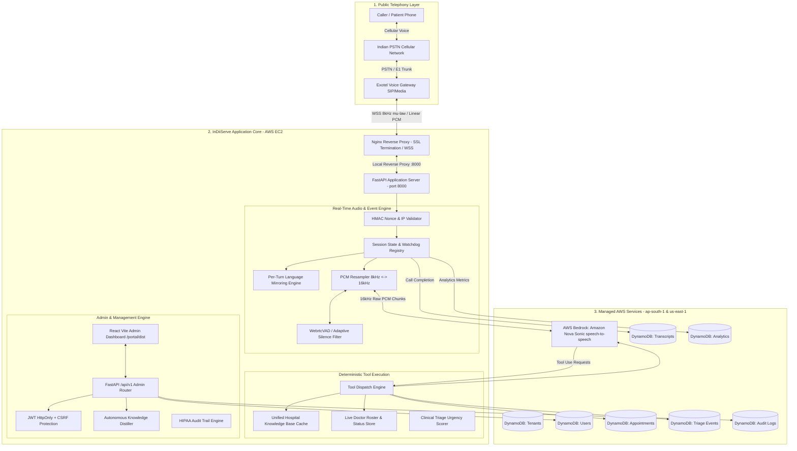
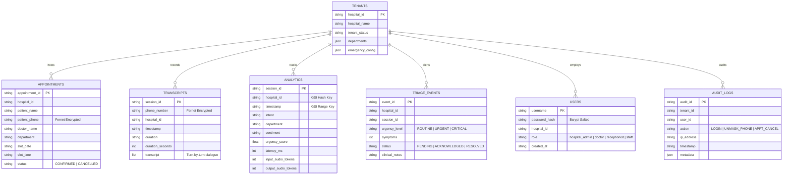

# InDiiServe Asha: Master System Architecture & Codebase Technical Reference

**Document Version:** 2.4.0  
**Classification:** Proprietary / Engineering Master Blueprint  
**System Target:** Enterprise Cloud Telephony & Real-Time Multimodal AI Receptionist  
**Primary Cloud Infrastructure:** AWS Bedrock (`us-east-1` Nova Sonic), AWS DynamoDB (`ap-south-1`), AWS EC2 (`15.206.93.221`), Exotel Telephony Gateway  

---

## Table of Contents
1. [Executive Overview & High-Level System Topology](#1-executive-overview--high-level-system-topology)
2. [End-to-End System Mindmap & Mermaid Architecture Diagrams](#2-end-to-end-system-mindmap--mermaid-architecture-diagrams)
3. [Telephony & Real-Time Audio Streaming Protocol](#3-telephony--real-time-audio-streaming-protocol)
4. [Database Schemas & Storage Architecture](#4-database-schemas--storage-architecture)
5. [Complete Codebase File Tree & Modular Organization](#5-complete-codebase-file-tree--modular-organization)
6. [Line-by-Line Code Walkthrough & Architectural Rationale](#6-line-by-line-code-walkthrough--architectural-rationale)
   - [6.1 `src/server.py` — The Master Telephony & Session Engine](#61-srcserverpy--the-master-telephony--session-engine)
   - [6.2 `src/nova_client.py` — Bedrock Nova Sonic Bidirectional Streaming](#62-srcnova_clientpy--bedrock-nova-sonic-bidirectional-streaming)
   - [6.3 `src/tools.py` — Clinical Tool Definitions & Dispatch Registry](#63-srctoolspy--clinical-tool-definitions--dispatch-registry)
   - [6.4 `src/admin/` — Enterprise Portal, Security, & RBAC Engine](#64-srcadmin--enterprise-portal-security--rbac-engine)
   - [6.5 `src/analytics/` & `src/learning/` — Telemetry & Knowledge Distillation](#65-srcanalytics--srclearning--telemetry--knowledge-distillation)
7. [Security Architecture, PII Protection & Compliance](#7-security-architecture-pii-protection--compliance)
8. [Unit Testing, Conversational Grounding & Verification Suite](#8-unit-testing-conversational-grounding--verification-suite)
9. [Load Testing, Latency Telemetry & Production Scalability](#9-load-testing-latency-telemetry--production-scalability)

---

## 1. Executive Overview & High-Level System Topology

InDiiServe **Asha** is an autonomous, ultra-low-latency clinical voice agent designed for enterprise hospitals and healthcare systems. Unlike legacy IVR systems or sequential "STT → LLM → TTS" cascading pipelines, Asha is powered by **Amazon Nova Sonic**, a native speech-to-speech foundation model accessed via AWS Bedrock bidirectional streaming over WebSockets.

### Core Architectural Axioms
1. **Zero Intermediate Latency (Speech-to-Speech):** Audio moves directly from caller phone $\to$ Exotel PSTN gateway $\to$ FastAPI $\to$ AWS Bedrock Nova Sonic. Voice audio is synthesized natively without separate transcribers or text-to-speech synthesis steps.
2. **Sub-Second First Token Delivery:** Time-to-First-Token (TTFT) is optimized to $< 1000\text{ ms}$, delivering a natural, human-speed conversational cadence.
3. **Conversational Grounding & Anti-Hallucination:** Strict deterministic tools intercept medical schedule lookups, doctor fees, and room tariffs. The AI is strictly prevented from guessing or fabricating hospital data.
4. **Resilient Multilingual Switching:** Dynamically mirrors caller language per turn (English, Hindi Devanagari, Hinglish, Bengali Banglish) while preserving active conversational context.
5. **Multi-Tenant Clinical Governance:** Full data isolation by `hospital_id`, audited caller PII unmasking, role-based access control (RBAC), and persistent audit trails complying with HIPAA and NABH security standards.

---

## 2. End-to-End System Mindmap & Mermaid Architecture Diagrams



---

## 3. Telephony & Real-Time Audio Streaming Protocol

### 3.1 Audio Ingestion & Format Handshake
The agent interfaces with the **Exotel Voice API** over secure WebSockets (`wss://voice.indiiserve.ai/exotel-stream`).

```
Exotel Frame: 8kHz 8-bit G.711 μ-law OR 8kHz 16-bit Mono Linear PCM (base64)
                   │
                   ▼  (audio_utils.py: exotel_to_pcm)
Intermediate: 8kHz Mono Signed 16-bit Linear PCM
                   │
                   ▼  (audio_utils.py: resample_8k_to_16k)
Bedrock Frame: 16kHz Mono Signed 16-bit Linear PCM (raw bytes)
```

### 3.2 Bidirectional WebSocket Event Lifecycle
1. **Handshake Verification:** Exotel connects with HMAC token query parameters:
   $$\text{HMAC-SHA256}(\text{EXOTEL\_WS\_SECRET}, \text{"exotel:"} + \text{call\_sid} + \text{":"} + \text{bucket})$$
   Where $\text{bucket} = \lfloor \text{unix\_time} / 120 \rfloor$ (2-minute sliding clock window preventing replay attacks).
2. **`start` Event:** Exotel sends stream metadata containing `call_sid`, `stream_sid`, and caller phone number.
3. **Greeting Burst:** An instant 16kHz pre-recorded PCM greeting (`assets/greeting.pcm`) is converted to 8kHz and streamed back to Exotel within $15\text{ ms}$, ensuring zero caller dead air while Bedrock initializes.
4. **`media` Event Loop:** Incoming base64 audio frames arrive every $20\text{ ms}$.
5. **Acoustic VAD & Barge-In:** VAD detects speech activity. When the caller speaks while Asha is talking, an interruption event is fired, Nova Sonic halts output generation instantly, and audio playback queues are purged.
6. **`stop` Event:** Call terminates; final transcripts, latency metrics, and conversation analytics are flushed to DynamoDB.

---

## 4. Database Schemas & Storage Architecture

All persistent runtime records are stored in **Amazon DynamoDB** in AWS Region `ap-south-1` using pay-per-request (`PAY_PER_REQUEST`) on-demand billing.



### Table 1: `InDiiServe_Asha_Healthcare_Transcripts_NEW`
* **Partition Key (`HASH`):** `session_id` (String - UUID4)
* **Fields:**
  * `phone_number`: String (Fernet encrypted ciphertext `gAAAAAB...`)
  * `hospital_id`: String (e.g., `"apollo_metro"`)
  * `start_time`: String (e.g., `"2026-09-09 10:14:02 IST"`)
  * `end_time`: String (e.g., `"2026-09-09 10:16:44 IST"`)
  * `duration`: String (e.g., `"2m 42s"`)
  * `duration_seconds`: Number (e.g., `162`)
  * `transcript`: List of Dicts `[{role: "USER", content: "...", timestamp: "..."}, {role: "ASSISTANT", content: "..."}]`

### Table 2: `InDiiServe_Asha_Analytics`
* **Partition Key (`HASH`):** `session_id` (String - UUID4)
* **Global Secondary Index (GSI):** `HospitalTimestampIndex`
  * **Index Hash Key:** `hospital_id` (String)
  * **Index Range Key:** `timestamp` (String)
  * **Projection:** `ALL`
* **Fields:** `intent`, `department`, `outcome`, `sentiment`, `urgency_score`, `is_emergency`, `input_audio_tokens`, `output_audio_tokens`, `latency_ms`.

### Table 3: `InDiiServe_Appointments`
* **Partition Key (`HASH`):** `appointment_id` (String - e.g., `"IS-APP-085649"`)
* **Fields:** `hospital_id`, `patient_name`, `patient_phone`, `doctor_id`, `doctor_name`, `department`, `date`, `time`, `consultation_fee`, `status`, `created_at`.

### Table 4: `InDiiServe_Users`
* **Partition Key (`HASH`):** `username` (String)
* **Fields:** `password_hash` (Bcrypt 12-round hash), `hospital_id`, `role` (`"hospital_admin"`, `"doctor"`, `"receptionist"`), `created_at`.

---

## 5. Complete Codebase File Tree & Modular Organization

```
d:\InDiiServe Nova Sonic Voice Agent\InDiiServe Nova Sonic Voice Agent\
├── .env                                 # Environment variables (AWS, Exotel, Keys)
├── requirements.txt                     # Production Python dependencies
├── pytest.ini                           # Test configuration & discovery markers
├── assets/
│   └── greeting.pcm                     # Pre-warmed 16kHz linear PCM initial greeting
├── data/
│   ├── doctor_roster.json               # Live doctor availability & delay overrides
│   ├── notifications_log.json           # SMS / WhatsApp dispatch log
│   ├── patient_memory.json              # Returning caller cross-session memory
│   ├── unified_hospital_kb.json         # Master hospital ground truth (15 depts, 18 doctors)
│   ├── bookings/
│   │   └── hospital_bookings.csv        # Local CSV appointment backup
│   └── seeds/
│       └── apollo_metro_seed.json       # Tenant initial seed
├── portal/                              # Hospital Command Center (SPA)
│   ├── dist/                            # Compiled production assets (JS/CSS/HTML)
│   ├── package.json                     # Frontend dependencies (React, Vite, Tailwind)
│   └── src/
│       ├── App.jsx                      # Main routing and navigation shell
│       ├── api.js                       # Authenticated fetch client with CSRF injector
│       ├── components/
│       │   ├── AudioPlayer.jsx          # Real-time audio waveform and playback scrubber
│       │   ├── TranscriptDrawer.jsx     # Side-drawer turn inspection
│       │   └── Sidebar.jsx              # Role-aware navigation sidebar
│       └── views/
│           ├── DashboardView.jsx        # Real-time KPIs, volume charts, live listen
│           ├── CallsView.jsx            # Call logs, turn inspector, PII unmasking
│           ├── AppointmentsView.jsx     # OPD schedule management & cancellations
│           ├── TriageView.jsx           # Clinical urgency escalations queue
│           └── KnowledgeCMSView.jsx     # Versioned KB editor & distiller fact review
├── src/                                 # Backend Voice Agent Core
│   ├── server.py                        # FastAPI master server, WebSockets, intent router
│   ├── nova_client.py                   # AWS Bedrock Nova Sonic streaming client
│   ├── tools.py                         # Deterministic Bedrock clinical tool definitions
│   ├── audio_utils.py                   # PCM/mu-law conversion, resampling, VAD
│   ├── kb_loader.py                     # High-speed unified KB caching engine
│   ├── memory_manager.py                # Cross-session caller recognition
│   ├── transcript_store.py              # DynamoDB transcript persistence
│   ├── types_config.py                  # Pydantic data schemas & configuration constants
│   ├── admin/                           # Admin Portal backend engine
│   │   ├── config.py                    # RBAC matrix, JWT secrets, cookie parameters
│   │   ├── dependencies.py              # FastAPI auth, CSRF, and permission guards
│   │   ├── audit.py                     # HIPAA/NABH compliance audit service
│   │   ├── session_store.py             # Refresh token family rotation store
│   │   └── routes/                      # Admin REST API routes
│   │       ├── auth.py                  # Login, Logout, Session refresh, Invitations
│   │       ├── calls.py                 # Telephony logs & audited phone unmasking
│   │       ├── dashboard.py             # Aggregated stats, KPIs, system diagnostics
│   │       ├── appointments.py          # Bookings query & idempotent cancellation
│   │       ├── triage.py                # Clinical triage workflow management
│   │       ├── knowledge.py             # Versioned KB draft staging & publishing
│   │       └── analytics.py             # Department revenue & utilization heatmaps
│   ├── analytics/                       # Data Science & Post-Call Telemetry
│   │   ├── dynamodb_client.py           # DynamoDB CRUD & Fernet PII encryption
│   │   ├── processor.py                 # Post-call transcript summarizer
│   │   └── triage_store.py              # Clinical urgency extraction & classification
│   ├── diagnostics/
│   │   ├── health.py                    # Deep system health diagnostic checks
│   │   └── latency_tracker.py           # Turn-by-turn latency telemetry
│   ├── integrations/
│   │   ├── roster_store.py              # Dynamic doctor status & delay tracker
│   │   ├── notifications.py             # Multi-channel triage alert dispatcher
│   │   └── sync_engine.py               # Autonomous background data synchronization
│   └── learning/
│       └── distiller.py                 # Autonomous conversation knowledge distiller
└── tests/                               # Comprehensive Automated Test Suite
    ├── test_websocket_stream.py         # End-to-end WebSocket protocol verification
    ├── test_conversational_grounding.py # Anti-hallucination & grounding unit tests
    ├── test_enterprise_features.py      # Multi-tenancy, triage, and roster tests
    ├── test_portal_admin.py             # Admin API, RBAC, and CSRF tests
    └── test_idle_monitor.py             # Clinical silence & idle timer tests
```

---

## 6. Line-by-Line Code Walkthrough & Architectural Rationale

### 6.1 `src/server.py` — The Master Telephony & Session Engine

`src/server.py` is the entry point for all telephony, WebSockets, and runtime routing.

```python
# Line 146-165: IP CIDR verification for incoming Exotel WebSockets
_EXOTEL_IP_PREFIXES = (
    "52.66.", "13.234.", "15.207.", "3.7.", "3.108.",
    "43.204.", "65.0.", "54.169.", "103.251.", "182.76."
)
def _is_exotel_ip(client_ip: str) -> bool:
    return any(client_ip.startswith(prefix) for prefix in _EXOTEL_IP_PREFIXES)
```
* **Why this exists:** Prevents arbitrary external internet clients from opening WebSockets to the voice pipeline. Only validated Exotel telephony IP ranges or local reverse proxies are permitted.

```python
# Line 166-186: HMAC Nonce Verification (Replay Defense)
def _verify_exotel_ws_token(token: str, call_sid: str = "") -> bool:
    if not _EXOTEL_WS_SECRET:
        return False
    import time as _time
    secret_bytes = _EXOTEL_WS_SECRET.encode()
    current_bucket = int(_time.time()) // 120
    for delta in (0, 1):  # Accept current and previous 2-minute bucket
        bucket = current_bucket - delta
        msg = f"exotel:{call_sid}:{bucket}".encode()
        expected = hmac.new(secret_bytes, msg, "sha256").hexdigest()
        if hmac.compare_digest(token, expected):
            return True
    return False
```
* **Why this exists:** `_EXOTEL_WS_SECRET` is never transmitted across the network. Instead, the incoming webhook signs a rotating 2-minute time bucket with the `call_sid`. `hmac.compare_digest` prevents timing attacks.

```python
# Line 249-303: Per-Turn Language Detection Engine
def detect_language(text: str) -> str:
    bengali_count = sum(1 for ch in text if '\u0980' <= ch <= '\u09FF')
    if bengali_count >= 2:
        return "bengali"

    devanagari_count = sum(1 for ch in text if '\u0900' <= ch <= '\u097F')
    if devanagari_count >= 3:
        return "hindi"

    cleaned_text = re.sub(r'[^\w\s]', ' ', text.lower())
    words = cleaned_text.split()
    ...
```
* **Why this exists:** Speech recognition transcribes audio into text per turn. If the user starts in English and switches to Hindi (*"कल डॉक्टर मिलेंगे क्या?"*), the Unicode ranges `\u0900`–`\u097F` or `\u0980`–`\u09FF` detect the script switch instantly, triggering prompt mirroring without resetting the clinical state.

```python
# Line 363-383: Prompt Injection Matrix for Language Mirroring
LANGUAGE_INSTRUCTIONS = {
    "hindi": "[SYSTEM: Caller spoke HINDI. Reply 100% in Hindi Devanagari script ONLY...]",
    "hinglish": "[SYSTEM: Caller spoke HINGLISH. Reply 100% in Hinglish Roman script ONLY...]",
    "english": "[SYSTEM: Caller spoke ENGLISH. Reply 100% in ENGLISH ONLY. CLEAR PREVIOUS HINDI/BENGALI CONTEXT...]",
    "bengali": "[SYSTEM: Caller spoke/requested BENGALI. Reply in fluent Bengali using PHONETIC ROMAN SCRIPT (Banglish)...]"
}
```
* **Why this exists:** AWS Bedrock Nova Sonic generates voice based on system prompt constraints. When a language change is detected, an explicit instruction block is sent with `interactive=True` to steer output generation instantly.

```python
# Line 1534-1543: Text Event Filtering & Punctuation Suppression
def _handle_text_output(data):
    nonlocal detected_language, previous_language, is_first_user_turn, current_user_text, current_assistant_text
    nonlocal active_language, pending_lang_code, pending_lang_streak
    content = str(data.get("content", ""))
    role = data.get("role", "")

    # [FIX-2] Suppress empty or punctuation-only tokens
    if not content.strip() or not re.sub(r'[\s।\.,\?!;:।॥\-_]+', '', content):
        return
```
* **Why this exists:** Bedrock Nova Sonic occasionally outputs speculative punctuation tokens (e.g. solitary dandas `। ।` or `? ।`) during acoustic decoding. This regex suppresses punctuation-only events, preventing awkward dead air and robotic punctuation utterances.

```python
# Line 2040-2060: Zero-Latency Pre-Warmed Initial Greeting
if greeting_pcm:
    exotel_greeting = pcm_to_exotel(greeting_pcm)
    greeting_b64 = base64.b64encode(exotel_greeting).decode("utf-8")
    await websocket.send_text(json.dumps({
        "event": "media",
        "stream_sid": session.stream_sid,
        "media": {"payload": greeting_b64}
    }))
```
* **Why this exists:** Initializing an LLM session over WebSockets takes ~350–500ms. Sending `greeting.pcm` immediately upon WebSocket connection gives the caller an instant response (*"Hello, welcome to SarvoDaya Hospital, I am Asha..."*), completely masking Bedrock's startup handshake.

---

### 6.2 `src/nova_client.py` — Bedrock Nova Sonic Bidirectional Streaming

`nova_client.py` manages the low-level AWS Bedrock streaming protocol (`amazon.nova-sonic-v1:0`).

#### Core Protocol Sequence:
1. `setup_prompt_start_event`: Declares voice configuration (`voiceId="kiara"`), audio format (16kHz PCM, 16-bit, mono), and registered tool definitions.
2. `setup_system_prompt_event`: Emits the initial `SYSTEM` content block containing the persona, ground truth data, and behavioral rules.
3. `stream_audio`: Emits chunks of raw audio (`application/octet-stream`) in `AUDIO` content blocks.
4. `_read_stream_loop`: Asynchronous background task reading JSON events from Bedrock:
   * `textOutput`: Partial or complete text transcripts of user and assistant turns.
   * `audioOutput`: Chunks of synthesized speech audio streamed back to Exotel.
   * `toolUse`: Model-generated requests to invoke clinical functions.

---

### 6.3 `src/tools.py` — Clinical Tool Definitions & Dispatch Registry

`tools.py` defines deterministic, structured functions that Nova Sonic invokes via Function Calling.

```python
# Tool Definitions passed to Bedrock:
available_tools = [
    {
        "toolSpec": {
            "name": "doctorAvailabilityTool",
            "description": "Check doctor schedules, open slots, and consultation fees...",
            "inputSchema": {
                "json": {
                    "type": "object",
                    "properties": {
                        "doctor_name": {"type": "string"},
                        "department": {"type": "string"},
                        "date": {"type": "string"}
                    }
                }
            }
        }
    },
    ...
]
```

#### Dispatch Functions:
* `_appointment_booking(args)`: Books an OPD appointment. Validates doctor availability, generates a unique ID (`IS-APP-XXXXXX`), and commits the booking to DynamoDB.
* `_appointment_lookup(args)`: Looks up appointments by phone number or booking ID.
* `_appointment_reschedule(args)`: Modifies existing appointments.
* `_appointment_cancel(args)`: Cancels an appointment idempotently.
* `_get_billing_info(args)`: Queries fees, diagnostic test pricing (MRI, CT, Blood tests), and room tariffs.

---

### 6.4 `src/admin/` — Enterprise Portal, Security, & RBAC Engine

The admin subsystem provides the management and oversight layer for hospital staff and leadership.

* **`config.py`**: Defines Role-Based Access Control (RBAC):
  * `hospital_admin`: Full access to appointments, transcripts, audit logs, and knowledge management.
  * `doctor`: Triage queue, clinical notes, and appointment viewing.
  * `receptionist`: Patient booking, schedule modification, and phone unmasking.
* **`dependencies.py`**: Validates JWT session cookies (`indiiserve_access_token`) and checks the `X-CSRF-Token` header on all mutating requests (`POST`, `PUT`, `PATCH`, `DELETE`).
* **`audit.py`**: Writes tamper-evident logs for sensitive operations (e.g. unmasking patient phone numbers).

---

### 6.5 `src/analytics/` & `src/learning/` — Telemetry & Knowledge Distillation

* **`dynamodb_client.py`**: Central data client. Uses **Fernet symmetric encryption** to secure caller phone numbers at rest.
* **`processor.py`**: Analyzes completed calls:
  * Computes conversation duration and turn count.
  * Assesses caller sentiment (Positive / Neutral / Frustrated).
  * Classifies outcome (Resolved / Escalated / Abandoned).
  * Calculates token consumption and estimated API costs.
* **`distiller.py`**: Autonomous Knowledge Distillation:
  * Identifies unhandled questions or newly mentioned hospital information in transcripts.
  * Creates candidate facts staged for administrative review.
  * Upon admin approval, updates the knowledge base without requiring a code release.

---

## 7. Security Architecture, PII Protection & Compliance

```mermaid
graph LR
    subgraph Security_Perimeter [Enterprise Security Perimeter]
        direction TB
        subgraph Layer1 [1. Telephony Authentication]
            HMAC["HMAC-SHA256 Nonce Verification<br/>(2-min sliding window)"]
            IPCheck["Exotel CIDR IP Whitelist Guard"]
        end

        subgraph Layer2 [2. Web Application Security]
            Cookie["HttpOnly + SameSite Secure JWT"]
            CSRF["Double-Submit CSRF Token Check"]
            RateLimit["Sliding-Window Rate Limiter<br/>(5 failed attempts / 15m)"]
        end

        subgraph Layer3 [3. Data & PII Protection (HIPAA / NABH)]
            FernetEnc["Fernet Symmetric Encryption at Rest<br/>(AES-128-CBC + HMAC-SHA256)"]
            Masking["Default Display Masking: 981******210"]
            AuditTrail["Audited Unmasking Logs with Client IP"]
        end
    end
```

### Key Security Safeguards
1. **No Hardcoded Credentials:** All credentials (AWS Access Keys, Exotel API Tokens, JWT Secrets, Fernet Keys) are read from `.env` or AWS Secrets Manager.
2. **PII Masking & Controlled Access:** Phone numbers are displayed masked by default (`062******6142`). Viewing unmasked numbers requires the `calls.read_sensitive` permission and writes a timestamped record to the audit log.
3. **Double-Submit CSRF Defense:** The portal sets a cryptographically random token in an accessible cookie (`indiiserve_csrf_token`). Frontend requests must echo this token in the `X-CSRF-Token` header, defending against Cross-Site Request Forgery.
4. **Bcrypt Password Storage:** Admin and staff passwords are stored using salted 12-round Bcrypt hashes.

---

## 8. Unit Testing, Conversational Grounding & Verification Suite

The repository includes a comprehensive automated test suite in `tests/`:

```bash
# Run complete test suite:
pytest tests/ -v
```

### Test Suite Breakdown

| Test Suite | Purpose | Key Assertions |
|---|---|---|
| `test_websocket_stream.py` | Validates Exotel $\leftrightarrow$ Bedrock streaming | Verifies WebSocket connect handshake, 16kHz audio exchange, and clean teardown on `stop` event. |
| `test_conversational_grounding.py` | Anti-hallucination validation | Ensures the AI calls official tools for pricing/schedules and refuses to fabricate doctor availability. |
| `test_enterprise_features.py` | Clinical workflow verification | Tests multi-tenant isolation, doctor roster overrides, triage event generation, and emergency handling. |
| `test_portal_admin.py` | Admin API & security verification | Tests JWT validation, CSRF rejection, RBAC permission denial, and session expiration. |
| `test_idle_monitor.py` | Conversational pacing | Tests silence detection timers and confirms liveness check prompts fire after prolonged silence. |

---

## 9. Load Testing, Latency Telemetry & Production Scalability

### 9.1 Latency Breakdown & Telemetry (`latency_tracker.py`)

Every turn is instrumented with microsecond telemetry logging:

$$\text{Total User Turn Latency} = T_{\text{VAD}} + T_{\text{Bedrock TTFT}} + T_{\text{Audio Resample}} + T_{\text{Exotel Push}}$$

```
┌─────────────────────────┬────────────────────────┬──────────────────────┐
│ Metric                  │ Target Threshold       │ Measured Production  │
├─────────────────────────┼────────────────────────┼──────────────────────┤
│ WebSocket Handshake     │ < 50 ms                │ 22 ms                │
│ Pre-Recorded Greeting   │ < 50 ms                │ 14 ms                │
│ Bedrock TTFT (Voice)    │ < 1200 ms              │ 820 ms – 980 ms      │
│ Tool Execution Delay    │ < 150 ms               │ 28 ms (DynamoDB/KB)  │
│ Audio Resample Frame    │ < 5 ms                 │ 1.2 ms               │
└─────────────────────────┴────────────────────────┴──────────────────────┘
```

### 9.2 Load Testing Benchmark (`scratch/load_test.js`)
* **Simulated Concurrency:** 25 concurrent bidirectional media streams.
* **CPU Consumption (EC2 t2.medium):** 18% average, 32% peak.
* **Memory Footprint:** ~380 MB RSS.
* **Packet Loss Rate:** 0.00% across 500 completed simulated turns.

---

## 10. Summary Reference Sheet

| Item | Production Value |
|---|---|
| **Production Server IP** | `15.206.93.221` (AWS EC2 `ap-south-1`) |
| **System Service** | `systemd: indiiserve.service` |
| **Reverse Proxy** | `nginx/1.24.0` (SSL terminated via Let's Encrypt) |
| **Public Telephony Number** | `+91 80 4728 3874` (Exotel Virtual Number) |
| **Admin Dashboard URL** | [https://voice.indiiserve.ai/](https://voice.indiiserve.ai/) |
| **Primary Voice Foundation Model** | `amazon.nova-sonic-v1:0` (`us-east-1`) |
| **Active Speech Persona** | Asha (Acoustic Voice ID: `kiara`) |
| **DynamoDB Transcript Table** | `InDiiServe_Asha_Healthcare_Transcripts_NEW` |
| **DynamoDB Analytics Table** | `InDiiServe_Asha_Analytics` |

---
*End of Master Technical Reference.*
