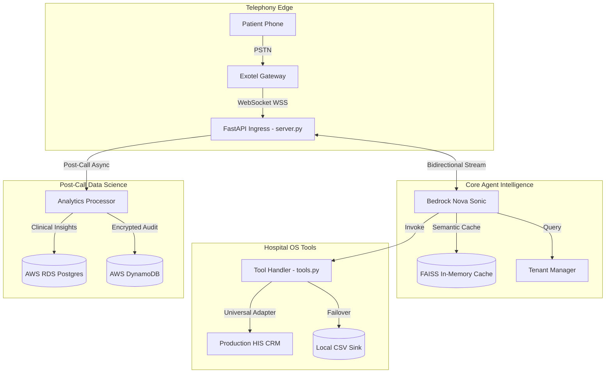
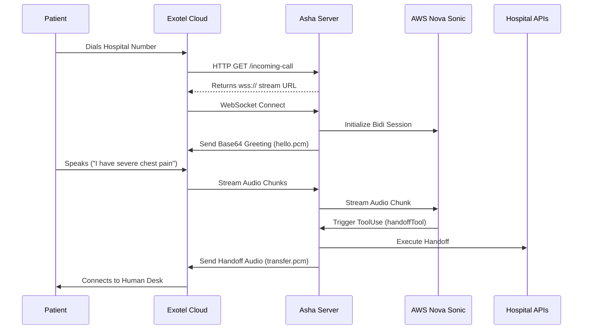
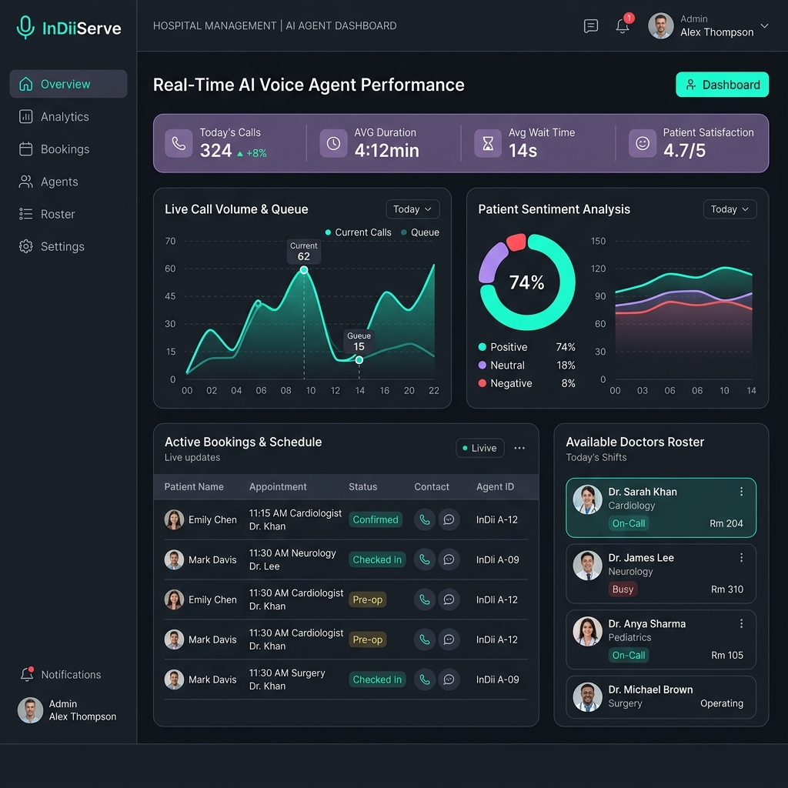

<div align="center">
  

  <h1>🏥 InDiiServe Nova Sonic: Sovereign Healthcare Voice Agent</h1>
  
  <p>
    <b>An enterprise-grade, ultra-low latency conversational AI designed specifically for the Indian Healthcare ecosystem.</b>
  </p>

  <!-- Badges -->
  <p>
    <a href="https://github.com/InDiiServe/nova-sonic-voice/actions"></a>
    <a href="https://python.org"></a>
    <a href="https://aws.amazon.com/bedrock/"></a>
    <a href="https://fastapi.tiangolo.com/"></a>
    <a href="LICENSE"></a>
  </p>
</div>

---

## 📖 Table of Contents
- [Executive Summary](#-executive-summary)
- [System Architecture & Flow](#-system-architecture--flow)
- [Core Engineering Features](#-core-engineering-features)
- [Directory Structure](#-directory-structure)
- [Deployment & Quick Start](#-deployment--quick-start)
- [Environment Configuration](#-environment-configuration)
- [Security & Compliance](#-security--compliance)
- [Post-Call Analytics & RDS](#-post-call-analytics--rds)

---

## 🚀 Executive Summary

In modern Indian healthcare facilities, ranging from metropolitan multi-specialty hubs to Tier-2 nursing homes, **The Voice Channel** remains a critical bottleneck. During peak OPD hours, human receptionists face extreme cognitive load, resulting in up to **35% dropped calls**, empathy erosion, and unrecorded clinical data.

**InDiiServe Nova Sonic (Project Asha)** is a state-of-the-art sovereign AI Voice Receptionist. It is engineered to:
- Respond in under `800ms` using AWS Bedrock Nova Sonic models.
- Support native **Hinglish** and Indian medical vernacular via RAG.
- Provide end-to-end multi-tenant isolation for hospital networks.
- Act as a dynamic, empathetic agent that never misses an appointment opportunity and escalates critical emergencies.

---

## 🏗️ System Architecture & Flow

Our architecture is heavily optimized for ultra-low latency real-time telephony streams, utilizing AWS Bedrock's Bidirectional Streaming API and FastAPI.

### 1. High-Level Component Architecture


### 2. Clinical Call Flow Sequence


---

## ✨ Core Engineering Features

| Feature | Technical Implementation | Impact |
|---------|--------------------------|--------|
| ⚡ **Sub-Second Latency** | Vectorized audio filtering (`scipy`), streaming bidirectional outputs, and `boto3` TCP connection pooling. | Near human-like response times (< 800ms TTFB). |
| 🏥 **Multi-Tenancy** | True "Clinic-in-a-Box" design via `TenantManager`. Switch hospital personalities, rules, and APIs by dynamically passing `HOSPITAL_ID`. | Run hundreds of hospitals on a single code base. |
| 🩺 **Clinical Triage** | Hard-coded emergency detection (`handoffTool`) overrides AI generation to instantly transfer critical patients to a human desk. | 100% Safety Compliance for critical care. |
| 🧠 **Persistent Memory** | Recognizes returning patients via AES-256 encrypted phone numbers, recalling historical context (`memory_manager.py`). | Premium, personalized patient experience. |
| 🛡️ **SSRF Protection** | Outbound sync requests use strict DNS pinning and `socket` validation to block private IP resolutions. | Defends against Server-Side Request Forgery. |

---

## 📂 Directory Structure

A clean, modular, and domain-driven design structure.

```text
InDiiServe-Nova-Sonic/
├── assets/                 # Pre-rendered PCM audio files (Greetings, Failovers)
├── data/                   # Mock DBs, Local CSV sinks, Knowledge JSONs
├── scripts/                # E2E test scripts, Data Generation, Sync helpers
├── src/                    # Core Application Code
│   ├── analytics/          # Post-call Bedrock analysis and RDS integration
│   ├── cache/              # Semantic FAISS caching and PCM audio caching
│   ├── dashboard/          # Streamlit UI for hospital admins
│   ├── diagnostics/        # Pre-flight health checks (health.py)
│   ├── integrations/       # External APIs (Sheets, Local Sink, Sync Engine)
│   ├── learning/           # Knowledge Distillation engines
│   ├── routing/            # Semantic Intent Router (Latency bypass)
│   ├── security/           # Audit Logging and PII encryption
│   ├── server.py           # FastAPI WebSockets & Route Definitions
│   ├── nova_client.py      # Bedrock Streaming Client Logic
│   ├── tools.py            # Hospital OS Tool definitions (Booking, Triage)
│   └── audio_utils.py      # PSTN Law-to-PCM conversions (scipy vectorization)
├── .env.example            # Environment template
├── check_deploy.py         # Production readiness vulnerability scanner
├── Dockerfile              # Containerization instructions
└── requirements.txt        # Pinned Python dependencies
```

---

## 🛠️ Deployment & Quick Start

### 1. Local Development
**Prerequisites:** Python 3.10+, AWS Account, Exotel Developer Account.

```bash
git clone https://github.com/InDiiServe/nova-sonic-voice.git
cd nova-sonic-voice

# Setup Environment
python -m venv .venv
source .venv/bin/activate
pip install -r requirements.txt

# Configure Secrets
cp .env.example .env
# [!] Edit .env with your AWS and Exotel keys

# Run the Development Server
uvicorn src.server:app --reload --port 8000
```

### 2. Production Deployment (AWS EC2 / ECS)
This system is hardened for production deployment. Before deploying, you **must** run our internal diagnostic tool to ensure no configuration vulnerabilities exist.
```bash
python check_deploy.py
```

For a detailed step-by-step guide on setting up `systemd`, `nginx`, Docker, and SSL on AWS, refer to the [PRODUCTION_SETUP.md](PRODUCTION_SETUP.md) guide.

---

## ⚙️ Environment Configuration

| Variable | Requirement | Description |
| :--- | :--- | :--- |
| `AWS_ACCESS_KEY_ID` | **Required** | AWS IAM Key with Bedrock Nova access. |
| `AWS_SECRET_ACCESS_KEY` | **Required** | AWS IAM Secret. |
| `EXOTEL_API_KEY` | **Required** | Exotel Telephony Auth Key. |
| `EXOTEL_API_TOKEN` | **Required** | Exotel Telephony Auth Token. |
| `EXOTEL_SID` | **Required** | Exotel Account SID. |
| `EXOTEL_SUBDOMAIN` | **Required** | Exotel API base (e.g., `api.exotel.com`). |
| `ENCRYPTION_KEY` | **Required** | Fernet AES-256 key for PII protection. |
| `WS_PUBLIC_URL` | **Required** | Public WSS endpoint of your deployed server. |
| `DEMO_MODE` | *Optional* | Set to `true` to enable chat backdoor. |
| `RDS_HOSTNAME` | *Optional* | Postgres DB Endpoint for Analytics. |

---

## 🛡️ Security & Compliance

In healthcare, patient data sovereignty is paramount. We implement a "Zero-Trust" data flow:

1. **No Shared Pools:** All processing occurs within your dedicated AWS VPC. No data is used to train generic external models.
2. **PII Hardening (AES-256):** Phone numbers and patient identifiers are symmetrically encrypted before being stored in RDS or DynamoDB. `rds_client.py` strictly enforces this.
3. **Audit Trails:** `SecurityAuditLogger` tracks every piece of data accessed by the AI, maintaining HIPAA/HIPAA-equivalent compliance logs.
4. **Rate Limiting:** `slowapi` protects all endpoints from DDoS or Telephony DoS attacks.

---

## 📊 Post-Call Analytics & RDS

Every call is processed asynchronously after termination.
1. The `AnalyticsProcessor` uses `amazon.nova-lite-v1:0` to distill the raw transcript into JSON metrics (Sentiment, Intent, Clinical Outcome, Urgency).
2. The data is saved to PostgreSQL (`RDS`).
3. Hospital administrators can view real-time data using the bundled Streamlit dashboard.

To launch the dashboard locally:
```bash
streamlit run src/dashboard/app.py
```

---
<div align="center">
  <p>Made with ❤️ by the InDiiServe Engineering Team.</p>
  
</div>
