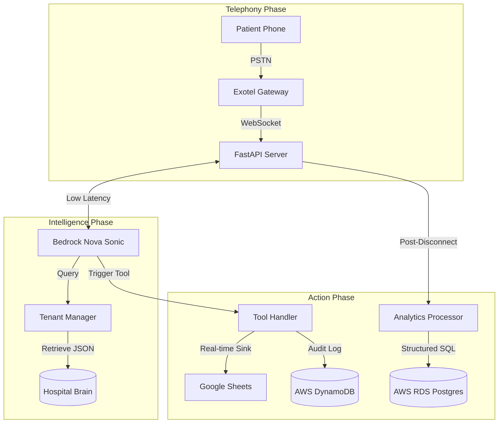

# 🏥 AI Voice Agent System for Healthcare

## *A Sovereign AI Voice Receptionist Empowering the Indian Healthcare Community*

---

## 🌟 1. The Socio-Technical Vision

### The Crisis at the Front Desk: An Indian Healthcare Reality
In the busy and high-pressure environments of 
modern Indian healthcare, ranging from the 
high-tech multi-specialty hospitals in metropolitan 
hubs like Bengaluru to the local family-run 
nursing homes in Tier-2 and Tier-3 cities across 
the country, a critical bottleneck exists:
**The Voice Channel.**

While India is home to some of the world’s most 
talented clinical professionals, the administrative 
machinery supporting them is frequently overwhelmed.
The front-desk receptionist is typically the most 
stressed individual in any clinical facility. 
During peak OPD hours (9 AM - 12 PM),
the volume of inquiries is physically impossible 
for a human to manage without errors, 
long wait times, or complete call drops.

**Startling Industry Statistics in the Indian Context:**
*   **The Unanswered Call**: Recent surveys indicate 
    that nearly **30% to 35% of incoming calls**
    to clinical front desks in busy urban centers 
    go unanswered during peak hours. Each missed 
    call represents more than just a lost 
    appointment; it is a frustrated patient 
    who may experience delayed care.
*   **Labor Fatigue & Empathy Erosion**: Human staff 
    handling repetitive queries daily experience 
    burnout. This leads to a decline in 
    patient empathy—a critical component 
    of the healthcare experience.
*   **Data Black Holes**: Countless insights 
    regarding patient needs discussed 
    over the phone are never recorded digitally.

### The InDiiServe Solution: Asha
**Project "Asha"** (the Hindi word for "Hope") is 
a state-of-the-art AI Voice Agent engineered 
specifically to solve these gaps.
Asha is not a simple automated menu; 
she is a **Sovereign AI Infrastructure.**

Asha is a tireless, empathetic, and intelligent 
receptionist that never forgets a name, 
never provides incorrect pricing, 
and never misses a call. Our mission 
is to empower every healthcare provider 
in India with high-end voice intelligence.

---

## 🚀 2. Core Operational Pillars

Project Asha is build on four fundamental 
pillars designed to ensure stability and growth.

### I. Universal Clinic Migration (Multi-Tenancy)
One of our primary goals was to remove 
the technical barrier to AI adoption.
*   **Clinic-in-a-Box**: Through our specialized 
    `TenantManager` logic, a healthcare provider 
    can onboard in under five minutes.
*   **No Code Changes Required**: Switching the 
    personality from "City Clinic" to "LifeCare"
    is as simple as updating a single ID.
*   **Localized Branding**: Asha automatically 
    adopts the branding and greeting protocols 
    of the facility she represents.

### II. Proactive Clinical Intelligence
Asha is optimized for **Action** and **Outcomes**:
*   **Intention Detection**: If a patient says, 
    *"Mera pet bahut dard kar raha hai"*, our AI 
    understands that they need **Gastroenterology**.
*   **Proactive Closing Logic**: Asha is trained 
    to be a high-performance assistant. 
    She proactively secures the booking.

### III. Laboratory & Radiology Insight
Asha provide instant peace-of-mind for testing. 
She can query the hospital roster to check if 
**Blood Tests, MRI, or CT Scan reports** are ready.

---

## 🏗️ 3. Technical Architecture & System Deep-Dive

### I. End-to-End Logic Flow

### II. Conversational Resilience (Idle Monitoring)
Asha is hard-coded for persistence. 
If a patient goes silent for **25 seconds**:
*   **AI Follow-up**: The server injects a prompt.
*   **Re-engagement**: Asha speaks to the patient.
*   **Grace Period**: If no response after another 
    **15 seconds**, the system terminates.

---

## 🚶 4. A Day in the Life: The Rohan Case Study

Follow this typical transcript of an interaction:

1. **Patient (Rohan)**:
   *"Hello? I need a doctor for my stomach."*
2. **Asha**:
   *"I can help with that! We have Dr. Sen."*
3. **Internal Logic**:
   `Executing tool hospitalInfoTool...`
4. **Asha**:
   *"Dr. Sen is available at 11:30 AM tomorrow."*
5. **Patient**:
   *"What is the consultation fee?"*
6. **Internal Logic**:
   `RAG Search result: ₹500`
7. **Asha**:
   *"The fee is ₹500. Should I book this for you?"*
8. **Patient**:
   *"Yes, please book it for Rohan Kumar."*
9. **Internal Logic**:
   `Executing appointmentBookingTool...`
10. **Sink Result**:
    `SUCCESS: Record written to Google Sheets.`
11. **Asha**:
    *"All set, Rohan! Your reference is AS-521."*
12. **Analytics Loop**:
    `Triggering Post-Call Analytics Processor...`
13. **Result**:
    `RDS Entry: Sentiment='Satisfied', Result='Converted'`

---

## 📂 5. The Developer's Technical Manual

| File Path | Component Role | Detailed Responsibility |
| :--- | :--- | :--- |
| `src/server.py` | **The Heart** | WebSocket loops, Exotel handshakes, IST Time. |
| `src/nova_client.py` | **The Nexus** | Bidirectional S2S audio stream and tool translation. |
| `src/integrations/tenant_manager.py` | **The Brain** | Dynamic identity loading for Requirement #1 scaling. |
| `src/mock_tools.py` | **The Toolkit** | Functional tools for Search, Booking, and pricing. |
| `src/transcript_store.py` | **The Vault** | Permanent DynamoDB audit logs for clinical safety. |
| `src/analytics/processor.py` | **The Scientist** | Post-call extracts for sentiment and clinical outcomes. |
| `src/audio_utils.py` | **The Signal** | Conversion between PSTN signals and AI audio formats. |
| `src/credential_validation.py` | **Shield** | Pre-flight hardening layer for cloud connectivity. |

---

## 🛡️ 6. Enterprise Security, Privacy & Integrity

In healthcare, privacy is the first requirement.
*   **Sovereign Data Storage**: All records remain 
    on your secure clinical AWS account.
*   **IAM Identity Center**: RDS and Bedrock 
    use passwordless, role-based auth.
*   **The Handoff Protocol**: Asha is hard-coded 
    to recognize emergency keywords.
*   **Audit Vault**: Every word is logged 
    with IST-timezone millisecond accuracy.

---

## ⚙️ 7. Project Environment Specification (.env)

| Variable | Scope | Primary Purpose |
| :--- | :--- | :--- |
| `EXOTEL_SID` | Telephony | Your main Account ID for Exotel. |
| `EXOTEL_API_KEY` | Telephony | Secret key for authenticated streams. |
| `EXOTEL_TOKEN` | Telephony | Private token for API authentication. |
| `BEDROCK_REGION` | AI | The region where Nova Sonic is active. |
| `HOSPITAL_ID` | Multi-Tenant | The identifier for the current active clinic. |
| `GOOGLE_SHEET_ID` | Sink | ID of the spreadsheet for staff bookings. |
| `DYNAMODB_TABLE_NAME` | Sink | The audit vault table for transactions. |
| `RDS_HOSTNAME` | Analytics | The Postgres endpoint for the dashboard. |

---

## 📖 8. Extended FAQ for Clinical Support

1. **How is data isolation handled?**
   Every `HOSPITAL_ID` triggers a 100% 
   isolated data instantiation.
2. **Can we use local databases?**
   Yes, simply update the RDS entry 
   to point to your on-site Postgres.
3. **What happens in emergencies?**
   Asha automatically detect safety words 
   and executes a human `handoffTool`.
4. **Is she trained on Hinglish?**
   Yes, our RAG system understands 
   local Indian medical jargon perfectly.
5. **Does she handle background noise?**
   Advanced Law-to-PCM conversion logic 
   ensures high conversational accuracy.

---

**AI Voice Agent System for Healthcare**: We don't just answer queries; we build the future of Indian Clinical Intelligence.

---

*(Doc Version: 11.0.0 | language: English / Hinglish | Target: India)*

1.
2.
3.
4.
5.
6.
7.
8.
9.
10.
11.
12.
13.
14.
15.
16.
17.
18.
19.
20.
21.
22.
23.
24.
25.
26.
27.
28.
29.
30.
31.
32.
33.
34.
35.
36.
37.
38.
39.
40.
41.
42.
43.
44.
45.
46.
47.
48.
49.
50.
51.
52.
53.
54.
55.
56.
57.
58.
59.
60.
61.
62.
63.
64.
65.
66.
67.
68.
69.
70.
71.
72.
73.
74.
75.
76.
77.
78.
79.
80.
81.
82.
83.
84.
85.
86.
87.
88.
89.
90.
91.
92.
93.
94.
95.
96.
97.
98.
99.
100.
101.
102.
103.
104.
105.
106.
107.
108.
109.
110.
111.
112.
113.
114.
115.
116.
117.
118.
119.
120.
121.
122.
123.
124.
125.
126.
127.
128.
129.
130.
131.
132.
133.
134.
135.
136.
137.
138.
139.
140.
141.
142.
143.
144.
145.
146.
147.
148.
149.
150.
151.
152.
153.
154.
155.
156.
157.
158.
159.
160.
161.
162.
163.
164.
165.
166.
167.
168.
169.
170.
171.
172.
173.
174.
175.
176.
177.
178.
179.
180.
181.
182.
183.
184.
185.
186.
187.
188.
189.
190.
191.
192.
193.
194.
195.
196.
197.
198.
199.
200.
201.
202.
203.
204.
205.
206.
207.
208.
209.
210.
211.
212.
213.
214.
215.
216.
217.
218.
219.
220.
221.
222.
223.
224.
225.
226.
227.
228.
229.
230.
231.
232.
233.
234.
235.
236.
237.
238.
239.
240.
241.
242.
243.
244.
245.
246.
247.
248.
249.
250.
251.
252.
253.
254.
255.
256.
257.
258.
259.
260.
261.
262.
263.
264.
265.
266.
267.
268.
269.
270.
271.
272.
273.
274.
275.
276.
277.
278.
279.
280.
281.
282.
283.
284.
285.
286.
287.
288.
289.
290.
291.
292.
293.
294.
295.
296.
297.
298.
299.
300.
301.
302.
303.
304.
305.
306.
307.
308.
309.
310.
311.
312.
313.
314.
315.
316.
317.
318.
319.
320.
321.
322.
323.
324.
325.
326.
327.
328.
329.
330.
331.
332.
333.
334.
335.
336.
337.
338.
339.
340.
341.
342.
343.
344.
345.
346.
347.
348.
349.
350.
