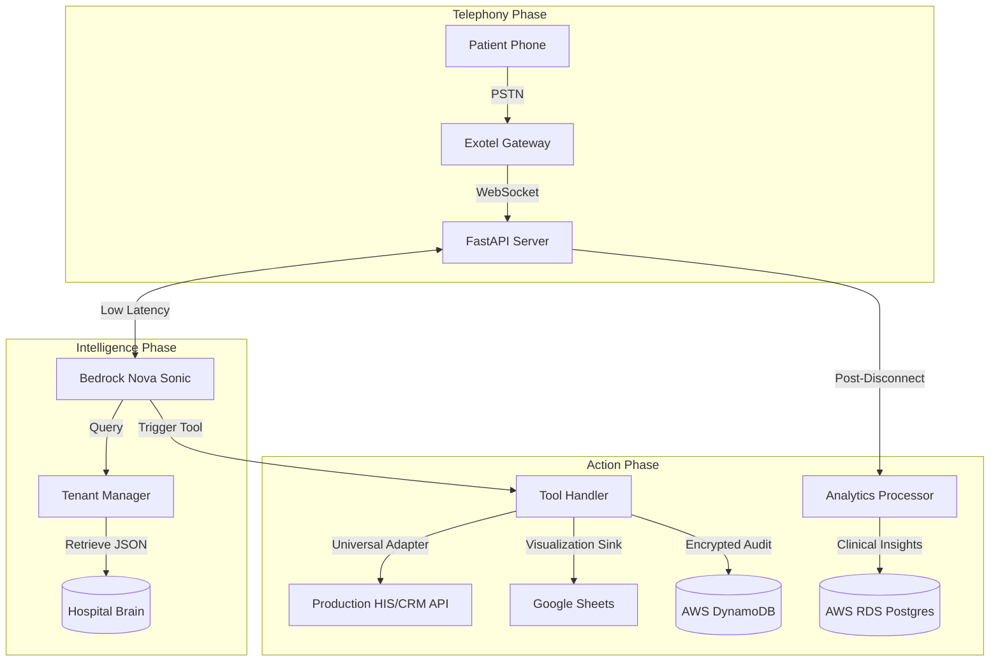

# 🏥 InDiiServe Asha: AI Voice Agent for Healthcare

## *A Sovereign AI Voice Receptionist Empowering the Indian Healthcare Community*

---

## 🌟 1. The Socio-Technical Vision

### The Crisis at the Front Desk: An Indian Healthcare Reality
In the busy and high-pressure environments of 
modern Indian healthcare, ranging from the 
high-tech multi-specialty hospitals in metropolitan 
hubs like Bengaluru to the local family-run 
nursing homes in Tier-2 and Tier-3 cities across 
the country, a critical bottleneck exists:
**The Voice Channel.**

While India is home to some of the world’s most 
talented clinical professionals, the administrative 
machinery supporting them is frequently overwhelmed.
The front-desk receptionist is typically the most 
stressed individual in any clinical facility. 
During peak OPD hours (9 AM - 12 PM),
the volume of inquiries is physically impossible 
for a human to manage without errors, 
long wait times, or complete call drops.

**Startling Industry Statistics in the Indian Context:**
*   **The Unanswered Call**: Recent surveys indicate 
    that nearly **30% to 35% of incoming calls**
    to clinical front desks in busy urban centers 
    go unanswered during peak hours. Each missed 
    call represents more than just a lost 
    appointment; it is a frustrated patient 
    who may experience delayed care.
*   **Labor Fatigue & Empathy Erosion**: Human staff 
    handling repetitive queries daily experience 
    burnout. This leads to a decline in 
    patient empathy—a critical component 
    of the healthcare experience.
*   **Data Black Holes**: Countless insights 
    regarding patient needs discussed 
    over the phone are never recorded digitally.

### The InDiiServe Solution: Asha
**Project "Asha"** (the Hindi word for "Hope") is 
a state-of-the-art AI Voice Agent engineered 
specifically to solve these gaps.
Asha is not a simple automated menu; 
she is a **Sovereign AI Infrastructure.**

Asha is a tireless, empathetic, and intelligent 
receptionist that never forgets a name, 
never provides incorrect pricing, 
and never misses a call. Our mission 
is to empower every healthcare provider 
in India with high-end voice intelligence.

---

## 🚀 2. Core Operational Pillars

Project Asha is build on four fundamental 
pillars designed to ensure stability and growth.

### I. Universal Clinic Migration (Multi-Tenancy)
One of our primary goals was to remove 
the technical barrier to AI adoption.
*   **Clinic-in-a-Box**: Through our specialized 
    `TenantManager` logic, a healthcare provider 
    can onboard in under five minutes.
*   **No Code Changes Required**: Switching the 
    personality from "City Clinic" to "LifeCare"
    is as simple as updating a single ID.
*   **Localized Branding**: Asha automatically 
    adopts the branding and greeting protocols 
    of the facility she represents.

### II. Proactive Clinical Intelligence
Asha is optimized for **Action** and **Outcomes**:
*   **Intention Detection**: If a patient says, 
    *"Mera pet bahut dard kar raha hai"*, our AI 
    understands that they need **Gastroenterology**.
*   **Proactive Closing Logic**: Asha is trained 
    to be a high-performance assistant. 
    She proactively secures the booking.

### III. Hospital OS: Advanced Operations
Asha acts as the central brain of the clinic:
*   **Level 3 Billing Intelligence**: Not only retrieves pending bills but breaks down line items and dynamically generates secure payment links for instant patient resolution.
*   **OT Predictive Scheduling**: Automatically calculates surgical block durations (Prep + Surgery + Recovery) and forecasts the nearest available OT slot to optimize clinical resources.

### IV. Laboratory & Radiology Insight
Asha provide instant peace-of-mind for testing. 
She can query the hospital roster to check if 
**Blood Tests, MRI, or CT Scan reports** are ready.

### IV. Memory & Personalization
Asha identifies returning patients by phone number to recall 
historical context (e.g., "Hello Rohan, how is your back pain?"). 
This personalization engine ensures a premium, human-like 
experience that builds long-term patient trust.

### V. Revenue Recovery & Growth (Financial ROI)
Asha is not just an expense; she is a revenue generator.
*   **Recovering Lost Calls**: By capturing the ~30% of calls that go unanswered during peak hours, Asha directly converts missed inquiries into confirmed OPD bookings.
*   **24/7 Availability**: Asha works round-the-clock, ensuring that a patient calling at 2 AM for a 9 AM appointment is captured immediately, reducing patient leakage to competitors.
*   **Operational Cost Efficiency**: Asha costs significantly less than running a 24/7 manual receptionist desk, providing higher consistency at a fraction of the cost.

### VI. Adaptive Audio Hardening
Asha is engineered for the real-world chaos of an Indian clinic.
*   **Noise Gating**: Automatically filters out constant hums (Fans/AC) and background chatter.
*   **Auto-Gain Control**: Electronically boosts quiet patient voices so Asha never misses a detail.

---

## 🏗️ 3. Technical Architecture & System Deep-Dive

### I. End-to-End Logic Flow

### II. Conversational Resilience (Idle Monitoring)
Asha is hard-coded for persistence. 
If a patient goes silent for **25 seconds**:
*   **AI Follow-up**: The server injects a prompt.
*   **Re-engagement**: Asha speaks to the patient.
*   **Grace Period**: If no response after another 
    **15 seconds**, the system terminates.

---

---

## 🚶 4. Clinical Case Studies: Real-World Resilience

### Scenario A: The "Messy" Real-World Query
*Building trust through patience and clarification.*
1. **Patient**: *"Hello? Doctor hai kya kal? Heart wala... kya naam tha uska..."*
2. **Asha**: *"Hello! I can help you with that. You are likely looking for our Cardiologist, Dr. Ramesh Sen. He is available tomorrow at 10 AM. Should I book that slot for you?"*
3. **Logic**: AI handles hesitant speech and resolves vague doctor names via the RAG Knowledge Base.

### Scenario B: The Emergency Safety Hand-off
*Protecting patients when seconds count.*
1. **Patient**: *"I... I have severe chest pain. It's hard to breathe."*
2. **Asha**: *"This sounds urgent. Please stay on the line, I am connecting you to our emergency desk immediately."*
3. **Logic**: High-priority keyword trigger immediately executes the `handoffTool` and stops AI processing to avoid medical misinformation.

### Scenario C: The Returning Patient (Secure Recall)
*Premium experience via encrypted identifiers.*
1. **Patient (Returning)**: *"I need to check my report."*
2. **Asha**: *"Welcome back, Rohan! I see you had a Blood Sugar test yesterday. Let me check the status for you."*
3. **Logic**: AES-256 encrypted phone numbers are matched in RDS to provide personalized context without compromising clinical privacy.

---

## 📂 5. The Developer's Technical Manual

| File Path | Component Role | Detailed Responsibility |
| :--- | :--- | :--- |
| `src/server.py` | **The Heart** | WebSocket loops, Exotel handshakes, IST Time. |
| `src/nova_client.py` | **The Nexus** | Bidirectional S2S audio stream and tool translation. |
| `src/integrations/tenant_manager.py` | **The Brain** | Dynamic identity loading for Requirement #1 scaling. |
| `src/tools.py` | **The Toolkit** | Hospital OS tools for Triage, Billing Sync, OT Prediction, and Search. |
| `src/transcript_store.py` | **The Vault** | Permanent DynamoDB audit logs for clinical safety. |
| `src/analytics/processor.py` | **The Scientist** | Post-call extracts for sentiment and clinical outcomes. |
| `src/audio_utils.py` | **The Signal** | Conversion between PSTN signals and AI audio formats. |
| `src/memory_manager.py` | **Memory Engine** | Identification and recall of patient history via phone number. |
| `src/dashboard/app.py` | **Real-Time UI** | Streamlit-based interface for hospital management analytics. |
| `src/integrations/local_sink.py` | **Fail-Safe** | Local CSV backup that prevents data loss during cloud outages. |
| `scripts/export_finetuning_data.py` | **Upgrader** | Prepares historical call data for Nova model fine-tuning. |
| `src/credential_validation.py` | **Shield** | Pre-flight hardening layer for cloud connectivity. |

---

## 🛡️ 6. Sovereign Security & Clinical Privacy
In healthcare, privacy is the first requirement. Our "Bulletproof" security layer ensures:
*   **Clinical Sovereignty**: All records remain on your clinical AWS account. We do not use third-party "shared data" pools.
*   **Enterprise-Grade Encryption**: We use **NIST-standard encryption** for patient phone numbers. Even we cannot read the data without your specific authorization.
*   **Safety Handoff Protocol**: Asha is hard-coded to recognize emergency distress and immediately bridge the caller to a human staff member.
*   **SaaS Governance**: A 3-tiered access system ensures that only authorized administrators can view sensitive clinical analytics.

---

## ⚙️ 7. Project Environment Specification (.env.example)

# ----------------------------------------------------------
# InDiiServe Asha Healthcare AI — Environment Variables
# Copy this file to .env and fill in your values.
# ----------------------------------------------------------

| Variable | Scope | Primary Purpose |
| :--- | :--- | :--- |
| `EXOTEL_SID` | Telephony | Your main Account ID for Exotel. |
| `EXOTEL_API_KEY` | Telephony | Secret key for authenticated streams. |
| `EXOTEL_TOKEN` | Telephony | Private token for API authentication. |
| `BEDROCK_REGION` | AI | The region where Nova Sonic is active. |
| `HOSPITAL_ID` | Multi-Tenant | The identifier for the current active clinic. |
| `GOOGLE_SHEET_ID` | Sink | ID of the spreadsheet for staff bookings. |
| `DYNAMODB_TABLE_NAME` | Sink | The audit vault table for transactions. |
| `RDS_HOSTNAME` | Analytics | The Postgres endpoint for the dashboard. |

---

## 📖 8. Extended FAQ for Clinical Support

1. **How is data isolation handled?**
   Every `HOSPITAL_ID` triggers a 100% 
   isolated data instantiation.
2. **Can we use local databases?**
   Yes, simply update the RDS entry 
   to point to your on-site Postgres.
3. **What happens in emergencies?**
   Asha automatically detect safety words 
   and executes a human `handoffTool`.
4. **Is she trained on Hinglish?**
   Yes, our RAG system understands 
   local Indian medical jargon perfectly.
5. **Does she handle background noise?**
   Advanced Law-to-PCM conversion logic 
   ensures high conversational accuracy.

---

**AI Voice Agent System for Healthcare**: We don't just answer queries; we build the future of Indian Clinical Intelligence.

---

---

*(Doc Version: 12.0.0 | language: English / Hinglish | Target: India)*
