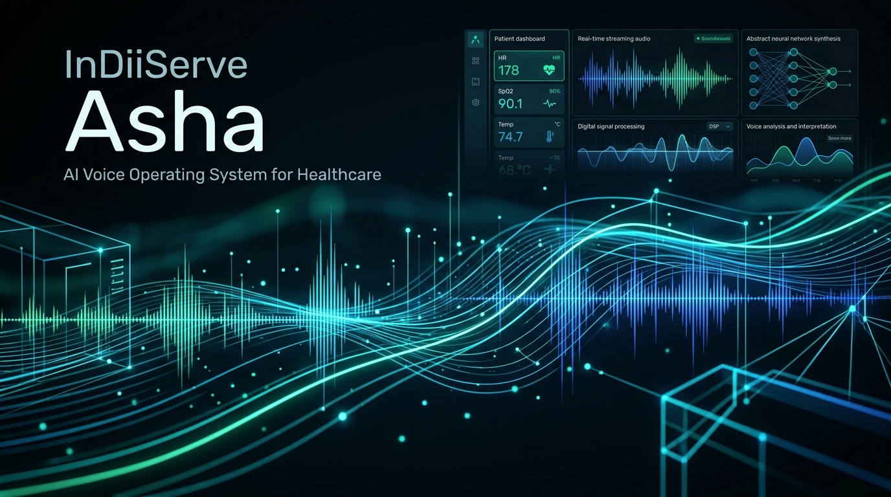
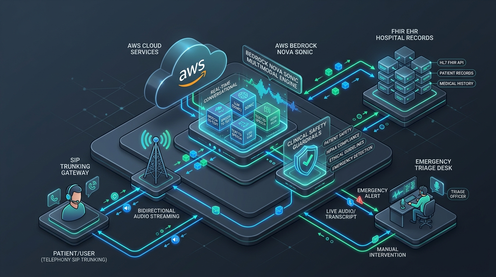
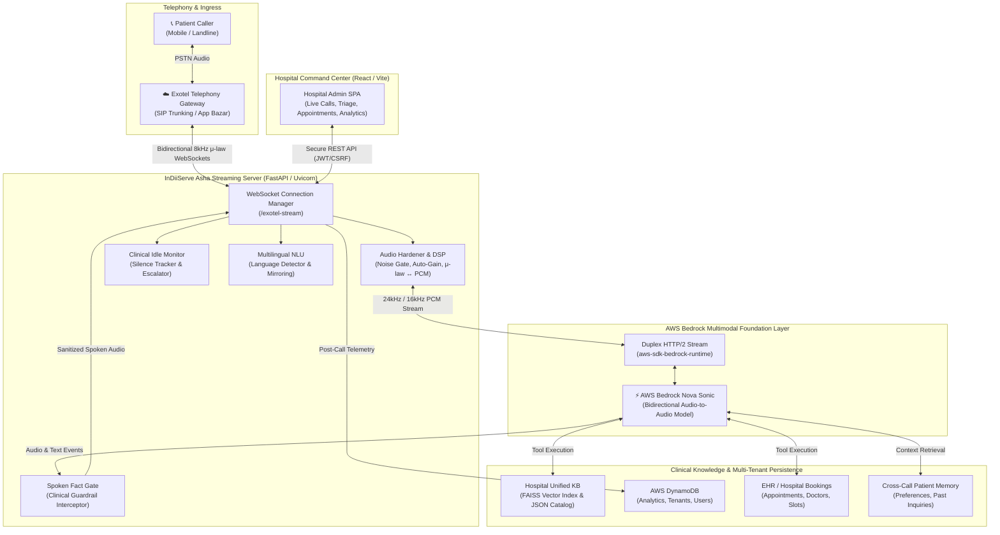
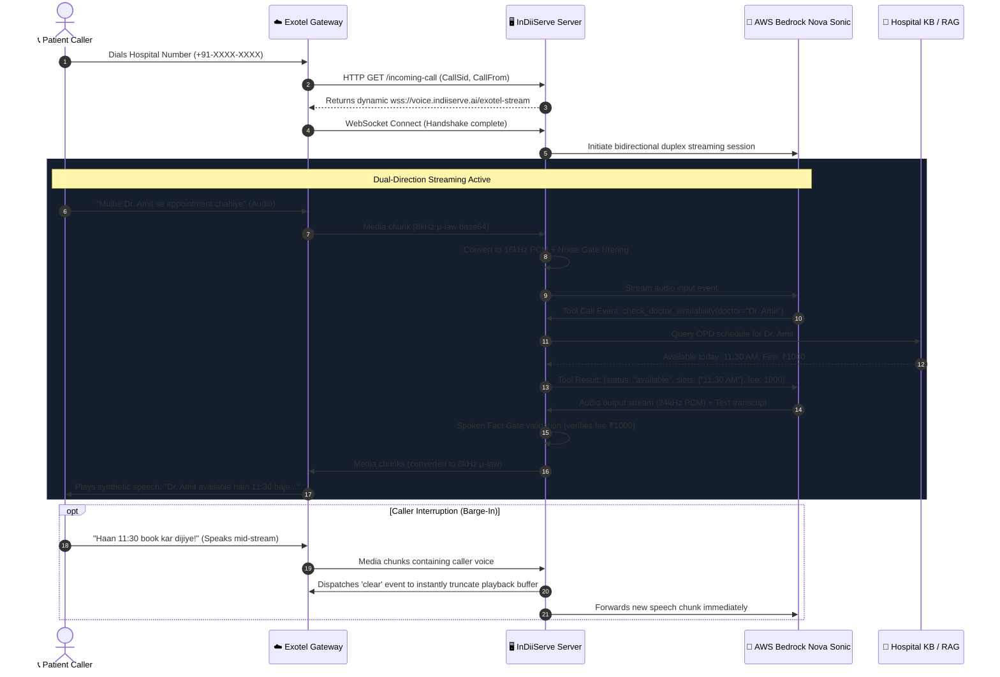
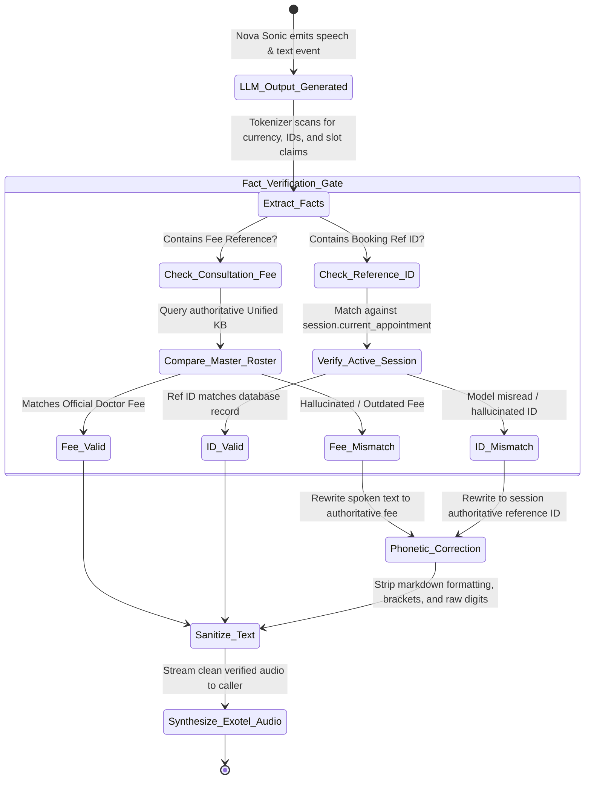

<p align="center">
  
</p>

<div align="center">

# InDiiServe Asha — Clinical Voice Operating System

### Real-Time, Multilingual Generative Voice Agent for Hospital Telephony & Clinical Operations

[](https://github.com/sid0803/ai-voice-agent-system-for-healthcare/actions/workflows/deploy.yml)
[](https://www.python.org/)
[](https://aws.amazon.com/bedrock/)
[](https://exotel.com/)
[](tests/)
[](src/security/)
[](#license)

<p align="center">
  <a href="#-key-architectural-highlights">Architecture</a> •
  <a href="#-system-architecture">System Design</a> •
  <a href="#-audio--telephony-pipeline">Audio Pipeline</a> •
  <a href="#-clinical-safety--spoken-fact-gate">Clinical Guardrails</a> •
  <a href="#-getting-started">Quick Start</a> •
  <a href="#-test-suite--quality-assurance">Testing</a> •
  <a href="#-admin-command-center">Admin Portal</a>
</p>

</div>

---

## 📌 Executive Overview

**InDiiServe Asha** is an enterprise-grade, real-time clinical voice operating system architected for hospital networks, medical centers, and healthcare providers in India. Powered by **Amazon Bedrock's Nova Sonic** multimodal foundation model and integrated directly into cloud telephony via **Exotel WebSocket Audio Streaming**, Asha eliminates traditional serial Voice-AI latency (`STT ➔ LLM ➔ TTS`) in favor of direct **full-duplex audio-to-audio neural streaming**.

Asha acts as a 24/7 empathetic, clinical-grade receptionist capable of understanding and speaking fluent **English, Hindi (Devanagari), Bengali, and conversational Hinglish**. The system handles outpatient department (OPD) appointment scheduling, diagnostic MRI/CT bookings, emergency triage escalation, real-time clinical fee verification, and persistent cross-call patient memory.

---

## ⚡ Key Architectural Highlights

* **Native Duplex Audio Streaming**: Real-time 8kHz μ-law / 24kHz PCM bidirectional audio streaming over low-latency WebSockets with sub-500ms conversational turn-taking and natural interruption (barge-in) handling.
* **Clinical Spoken Fact Gate**: Real-time hallucination interception layer that verifies spoken consultation fees and appointment reference IDs against authoritative hospital master tables before audio leaves the server.
* **Trilingual & Code-Switching NLU**: Dynamic language detection and mirroring supporting English, formal Hindi, Bengali Unicode, and colloquial Hinglish postpositions (`ki`, `ka`, `mein`, `kitni`).
* **Emergency Silence & Handoff Escalator**: Automated clinical silence monitor that detects patient distress or unresponsive callers, dispatches reassuring check-ins, triggers emergency desk alerts, and cleanly hands off calls.
* **PII Redaction & Cryptographic Security**: Fernet-encrypted patient phone numbers, Bcrypt password hashing, HttpOnly JWT token families with automatic rotation, and strict CSRF protection.
* **Production-Validated Resilience**: Tested with **176 automated regression and integration test suites** running across CI/CD on Python 3.12 and Linux EC2 deployments.

---

## 🏛️ System Architecture

<p align="center">
  
</p>

The platform is structured into decoupled, high-performance layers connecting inbound telephony, multimodal AI synthesis, clinical verification, and persistent healthcare records:


```mermaid
flowchart TB
    subgraph Caller_Layer["Telephony & Ingress"]
        Caller["📞 Patient Caller\n(Mobile / Landline)"]
        Exotel["☁️ Exotel Telephony Gateway\n(SIP Trunking / App Bazar)"]
    end

    subgraph Streaming_Core["InDiiServe Asha Streaming Server (FastAPI / Uvicorn)"]
        direction TB
        WS_Handler["WebSocket Connection Manager\n(/exotel-stream)"]
        Audio_DSP["Audio Hardener & DSP\n(Noise Gate, Auto-Gain, μ-law ↔ PCM)"]
        Idle_Mon["Clinical Idle Monitor\n(Silence Tracker & Escalator)"]
        Lang_Engine["Multilingual NLU\n(Language Detector & Mirroring)"]
        Fact_Gate["Spoken Fact Gate\n(Clinical Guardrail Interceptor)"]
    end

    subgraph AI_Engine["AWS Bedrock Multimodal Foundation Layer"]
        Nova_Sonic["⚡ AWS Bedrock Nova Sonic\n(Bidirectional Audio-to-Audio Model)"]
        Bedrock_Stream["Duplex HTTP/2 Stream\n(aws-sdk-bedrock-runtime)"]
    end

    subgraph Data_Layer["Clinical Knowledge & Multi-Tenant Persistence"]
        KB_RAG["Hospital Unified KB\n(FAISS Vector Index & JSON Catalog)"]
        Dynamo_Analytics["AWS DynamoDB\n(Analytics, Tenants, Users)"]
        Appointments_DB["EHR / Hospital Bookings\n(Appointments, Doctors, Slots)"]
        Patient_Memory["Cross-Call Patient Memory\n(Preferences, Past Inquiries)"]
    end

    subgraph Admin_Portal["Hospital Command Center (React / Vite)"]
        Portal_UI["Hospital Admin SPA\n(Live Calls, Triage, Appointments, Analytics)"]
    end

    Caller <-->|"PSTN Audio"| Exotel
    Exotel <-->|"Bidirectional 8kHz μ-law WebSockets"| WS_Handler
    WS_Handler --> Audio_DSP
    Audio_DSP <-->|"24kHz / 16kHz PCM Stream"| Bedrock_Stream
    Bedrock_Stream <--> Nova_Sonic

    WS_Handler --> Idle_Mon
    WS_Handler --> Lang_Engine
    Nova_Sonic -->|"Audio & Text Events"| Fact_Gate
    Fact_Gate -->|"Sanitized Spoken Audio"| WS_Handler

    Nova_Sonic <-->|"Tool Execution"| KB_RAG
    Nova_Sonic <-->|"Tool Execution"| Appointments_DB
    Nova_Sonic <-->|"Context Retrieval"| Patient_Memory
    WS_Handler -->|"Post-Call Telemetry"| Dynamo_Analytics
    Portal_UI <-->|"Secure REST API (JWT/CSRF)"| WS_Handler
```

---

## 🌊 Audio & Telephony Pipeline

The sequence below illustrates the lifecycle of an inbound hospital inquiry, demonstrating full-duplex streaming, tool execution, and natural barge-in interruption:


```mermaid
sequenceDiagram
    autonumber
    actor Patient as 📞 Patient Caller
    participant Exotel as ☁️ Exotel Gateway
    participant Asha as 🖥️ InDiiServe Server
    participant Bedrock as 🧠 AWS Bedrock Nova Sonic
    participant KB as 🏥 Hospital KB / RAG

    Patient->>Exotel: Dials Hospital Number (+91-XXXX-XXXX)
    Exotel->>Asha: HTTP GET /incoming-call (CallSid, CallFrom)
    Asha-->>Exotel: Returns dynamic wss://voice.indiiserve.ai/exotel-stream
    Exotel->>Asha: WebSocket Connect (Handshake complete)
    Asha->>Bedrock: Initiate bidirectional duplex streaming session
    
    rect rgb(20, 30, 45)
        note over Patient,Bedrock: Dual-Direction Streaming Active
        Patient->>Exotel: "Mujhe Dr. Amit se appointment chahiye" (Audio)
        Exotel->>Asha: Media chunk (8kHz μ-law base64)
        Asha->>Asha: Convert to 16kHz PCM + Noise Gate filtering
        Asha->>Bedrock: Stream audio input event
        Bedrock->>Asha: Tool Call Event: check_doctor_availability(doctor="Dr. Amit")
        Asha->>KB: Query OPD schedule for Dr. Amit
        KB-->>Asha: Available today: 11:30 AM, Fee: ₹1000
        Asha->>Bedrock: Tool Result: {status: "available", slots: ["11:30 AM"], fee: 1000}
        Bedrock->>Asha: Audio output stream (24kHz PCM) + Text transcript
        Asha->>Asha: Spoken Fact Gate validation (verifies fee ₹1000)
        Asha->>Exotel: Media chunks (converted to 8kHz μ-law)
        Exotel->>Patient: Plays synthetic speech: "Dr. Amit available hain 11:30 baje..."
    end

    opt Caller Interruption (Barge-In)
        Patient->>Exotel: "Haan 11:30 book kar dijiye!" (Speaks mid-stream)
        Exotel->>Asha: Media chunks containing caller voice
        Asha->>Exotel: Dispatches 'clear' event to instantly truncate playback buffer
        Asha->>Bedrock: Forwards new speech chunk immediately
    end
```

---

## 🛡️ Clinical Safety & Spoken Fact Gate

In hospital telephony, hallucinations regarding fees, booking IDs, or doctor presence can lead to severe operational and clinical fallout. The **Spoken Fact Gate** ([`src/guards.py`](src/guards.py)) operates as a deterministic verification gate that intercepts model speech tokens prior to transmission:


```mermaid
stateDiagram-v2
    [*] --> LLM_Output_Generated: Nova Sonic emits speech & text event
    LLM_Output_Generated --> Extract_Facts: Tokenizer scans for currency, IDs, and slot claims
    
    state Fact_Verification_Gate {
        Extract_Facts --> Check_Consultation_Fee: Contains Fee Reference?
        Check_Consultation_Fee --> Compare_Master_Roster: Query authoritative Unified KB
        Compare_Master_Roster --> Fee_Valid: Matches Official Doctor Fee
        Compare_Master_Roster --> Fee_Mismatch: Hallucinated / Outdated Fee
        
        Extract_Facts --> Check_Reference_ID: Contains Booking Ref ID?
        Check_Reference_ID --> Verify_Active_Session: Match against session.current_appointment
        Verify_Active_Session --> ID_Valid: Ref ID matches database record
        Verify_Active_Session --> ID_Mismatch: Model misread / hallucinated ID
    }

    Fee_Mismatch --> Phonetic_Correction: Rewrite spoken text to authoritative fee
    ID_Mismatch --> Phonetic_Correction: Rewrite to session authoritative reference ID
    Fee_Valid --> Sanitize_Text
    ID_Valid --> Sanitize_Text
    Phonetic_Correction --> Sanitize_Text: Strip markdown formatting, brackets, and raw digits

    Sanitize_Text --> Synthesize_Exotel_Audio: Stream clean verified audio to caller
    Synthesize_Exotel_Audio --> [*]
```

---

## 📂 Codebase Organization

The repository is decoupled into specialized single-responsibility modules:

```
InDiiServe-Nova-Sonic-Voice-Agent/
├── .github/
│   └── workflows/
│       └── deploy.yml            # Automated CI/CD pipeline (pytest suite & EC2 deployment)
├── assets/                       # High-resolution architectural diagrams, UI banners & audio cues
│   ├── hero_banner.jpg           # Hero graphic for documentation & presentations
│   ├── architecture_diagram.jpg  # End-to-end cloud infrastructure diagram
│   └── *.pcm                     # Audio cues (emergency sirens, transfer chimes, greetings)
├── data/                         # Clinical knowledge catalogs & local persistence
│   ├── unified_hospital_kb.json  # Master hospital database (Doctors, OPD, Fees, Facilities)
│   ├── doctor_roster.json        # Live daily duty schedule and OPD timings
│   ├── patient_memory.json       # Cross-call caller memory & preference store
│   └── bookings/                 # Appointment sink & CSV records
├── portal/                       # Hospital Command Center (React, Vite, TailwindCSS)
│   ├── src/
│   │   ├── views/                # Dashboard, Live Calls, Triage Desk, Analytics, KB CMS
│   │   └── api.js                # Authenticated client with CSRF token injection
│   └── package.json
├── src/                          # Core Python 3.12+ backend source code
│   ├── admin/                    # Admin REST API routes, RBAC permissions, and JWT auth
│   │   ├── routes/               # Modular routers (auth, calls, appointments, triage, kb)
│   │   ├── config.py             # RBAC configuration, permission matrices, cookie policies
│   │   └── dependencies.py       # JWT validation, rate limiting, and session verification
│   ├── analytics/                # DynamoDB telemetry and metrics streaming
│   │   └── dynamodb_client.py    # AWS DynamoDB client with Fernet PII encryption
│   ├── audio_utils.py            # Vectorized DSP routines (μ-law ↔ PCM, noise gate, normalization)
│   ├── compat.py                 # Platform-specific compatibility patches (Windows WMI, asyncio)
│   ├── guards.py                 # Spoken Fact Gate & text sanitization guardrails
│   ├── idle_monitor.py           # Clinical silence tracking & emergency escalation session
│   ├── kb_loader.py              # Knowledge base parser & FAISS vector search loader
│   ├── language.py               # Multilingual NLU, Devanagari/Bengali detector, gender persona
│   ├── nova_client.py            # AWS Bedrock Nova Sonic duplex client & session manager
│   ├── rendering.py              # Phonetic formatters for reference IDs, currency, and time
│   ├── server.py                 # FastAPI application root, WebSocket streaming, and call router
│   └── tools.py                  # Clinical tool execution engine (Appointments, Triage, RAG)
├── tests/                        # 17 automated test suites (176 tests, 100% pass rate)
│   ├── test_guards_unit.py       # Fact Gate unit verification
│   ├── test_language_unit.py     # Multilingual detection & Hinglish postposition tests
│   ├── test_idle_monitor.py      # Silence tracking & escalation tests
│   ├── test_rendering_unit.py    # Phonetic formatting tests
│   ├── test_security_unit.py     # Password hashing, JWT hardening, PII masking tests
│   └── test_websocket_stream.py  # WebSocket lifecycle & session management tests
├── .env.example                  # Sanitized environment template with documented keys
├── END_TO_END_CHANGES_LOG.md     # Comprehensive audit ledger of every modification made
├── pytest.ini                    # Automated test discovery and asyncio execution rules
└── requirements.txt              # Pinned production dependencies
```

---

## 🚀 Getting Started

### 1. Prerequisites
* **Python 3.12+** (Tested on Python 3.12 and 3.14)
* **Node.js 20+** (for building the Admin Portal)
* **AWS IAM Credentials** with `bedrock:InvokeModelWithResponseStream` permissions
* **Exotel Account** with an active virtual phone number and WebSocket App Bazar access

### 2. Installation & Setup

1. **Clone the Repository**:
   ```bash
   git clone https://github.com/sid0803/ai-voice-agent-system-for-healthcare.git
   cd ai-voice-agent-system-for-healthcare
   ```

2. **Create and Activate Virtual Environment**:
   ```bash
   python -m venv venv
   # On Linux/macOS:
   source venv/bin/activate
   # On Windows:
   .\venv\Scripts\activate
   ```

3. **Install Dependencies**:
   ```bash
   pip install -r requirements.txt
   ```

4. **Configure Environment Variables**:
   Copy the provided `.env.example` template and fill in your credentials:
   ```bash
   cp .env.example .env
   ```

   Key required configuration values:
   ```env
   # AWS Bedrock Configuration
   AWS_ACCESS_KEY_ID=your_aws_access_key
   AWS_SECRET_ACCESS_KEY=your_aws_secret_key
   AWS_REGION=ap-south-1
   BEDROCK_REGION=us-east-1

   # Telephony (Exotel)
   EXOTEL_API_KEY=your_exotel_api_key
   EXOTEL_API_TOKEN=your_exotel_token
   EXOTEL_SID=your_exotel_sid
   EXOTEL_SUBDOMAIN=api.exotel.com
   EXOTEL_WS_SECRET=your_telephony_webhook_signing_secret

   # Security & Administrative Auth
   ENVIRONMENT=development
   ADMIN_JWT_SECRET=your_custom_32_character_cryptographic_secret
   ENCRYPTION_KEY=your_fernet_key_for_pii_encryption
   ```

---

## 🏃 Running the Platform

### Start the Voice Agent Telephony Server
```bash
python -m src.server
# Or using Uvicorn directly:
uvicorn src.server:app --host 0.0.0.0 --port 8000 --reload
```
The server will boot and verify:
* ✅ AWS Bedrock connection to `amazon.nova-sonic-v1:0`
* ✅ DynamoDB analytics and user tables
* ✅ Local Unified Hospital Knowledge Base loaded into FAISS vector space
* ✅ Health endpoint active at `http://localhost:8000/health`

### Launch the Hospital Command Center (Portal)
```bash
cd portal
npm install
npm run dev
```
Open your browser at `http://localhost:5173` (or port `8000` when running the production SPA build).

---

## 🧪 Test Suite & Quality Assurance

The codebase includes an extensive suite of **176 unit, integration, and security tests** across 17 test modules.

```bash
# Run the entire test suite:
pytest tests/ -v

# Run with concise summary:
pytest tests/ -q
```

### Verified Test Metrics:
```
tests/test_asha_hardening.py ............                             [  6%]
tests/test_conversational_grounding.py .................              [ 16%]
tests/test_enterprise_features.py ...........                        [ 22%]
tests/test_guards_unit.py .......                                     [ 26%]
tests/test_idle_monitor.py ..........                                 [ 32%]
tests/test_language_unit.py .........                                 [ 37%]
tests/test_live_receptionist_hardening.py ..........                  [ 43%]
tests/test_master_hardening.py .........................              [ 57%]
tests/test_phase1_fixes.py .............                              [ 64%]
tests/test_phase1_identity.py .......                                 [ 68%]
tests/test_portal_admin.py ..........                                 [ 74%]
tests/test_portal_advanced.py ....                                    [ 76%]
tests/test_production_validation.py ...............                   [ 85%]
tests/test_rendering_unit.py ....                                     [ 87%]
tests/test_security_unit.py ...........                               [ 93%]
tests/test_tools_unit.py ......                                       [ 96%]
tests/test_websocket_stream.py ......                                 [100%]

===================== 176 passed in 13.46s =====================
```

---

## 🖥️ Admin Command Center

The built-in Admin Portal provides hospital operations teams with a complete command center:

| View | Purpose | Key Capabilities |
|---|---|---|
| **Live Call Monitor** | Telephony Observability | Real-time waveform streaming, active session count, live transcripts |
| **Emergency Triage Desk** | Patient Safety | Real-time red alerts for critical symptoms, caller phone, one-click escalation |
| **OPD Appointments** | Schedule Management | Interactive booking grid, doctor slot availability, cancellation with idempotency |
| **Knowledge Base CMS** | Content Management | Live editing of doctor fees, OPD hours, lab tests, and hospital FAQ |
| **Telemetry Analytics** | Post-Call Intelligence | Sentiment tracking, Bedrock token usage, call duration, and triage urgency scores |

---

## 🔒 Security & HIPAA-Grade Compliance

* **Zero Plaintext Secrets**: All sensitive environment keys are managed via isolated `.env` configurations; tracked templates (`.env.example`) contain only sanitized placeholders.
* **PII Redaction**: Patient mobile numbers are masked in all console logs (`987******3210`) and encrypted at rest in DynamoDB via 128-bit Fernet AES encryption.
* **Hardened Authentication**: Default staging passwords (`admin123`, `doctor123`) are strictly blocked in production mode. Passwords must verify against salted Bcrypt hashes.
* **JWT Token Security**: Uses asymmetric or HS256-signed HttpOnly cookies with automatic refresh token family rotation; stale rotated tokens trigger instant family revocation.
* **Strict Cross-Origin Isolation**: CORS is locked to approved hospital domain origins rather than wildcards (`*`).

---

## 📄 License & Intellectual Property

This project is proprietary and confidential.  
Copyright © 2026 InDiiServe Technologies. All rights reserved.
